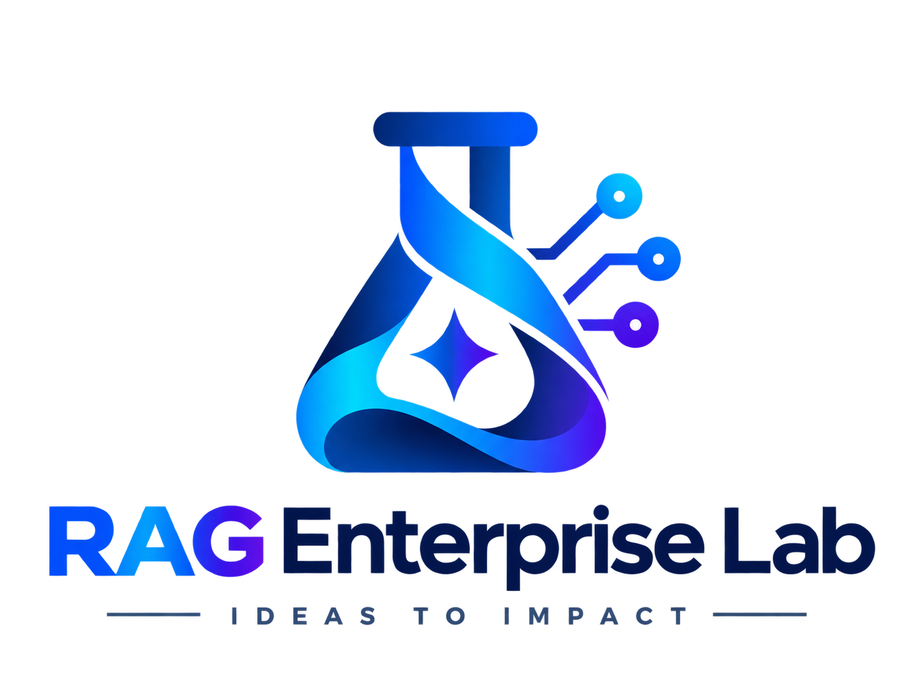

<p align="right">
  English | <a href="https://github.com/cnanaj-wq/RAG-Enterprise-Lab/blob/main/README.fr.md">Français</a>
</p>

<p align="center">
  
</p>

# RAG Enterprise Lab

Technical blueprint for a governed enterprise RAG system built for **GenAI Enterprise Lab**.

## Objective

> Retrieve the right information, in the right version, for the right person, with verifiable sources.

Simulated environment:

- 120 employees
- 5,000 modeled document resources
- client / supplier / HR contracts
- agreements, pricing grids, procedures, runbooks
- document completeness checks
- version conflicts
- ACL / RBAC / ABAC
- GDPR
- audit and evaluation
- flagship business use case: monthly closing of commercial signatures

To keep the demo fast, the catalog models **5,000 document resources**, while the interactive execution uses a controlled subset of documents that are actually parsed, chunked, and indexed.

---

# Architecture

The project follows a **cloud-first** architecture: the developer workstation should not hold the full document corpus.

## Software Architecture: Cloud FIRST

> GitHub READMEs do not support interactive JavaScript carousels. This **horizontal card layout** serves the same purpose visually by giving a quick overview of each component and its function.

| ☁️ Cloudflare R2 | 🏗️ Cloud Build | 📦 Artifact Registry | 🔐 Secret Manager | ⚙️ Cloud Run Jobs | 🖥️ Cloud Shell |
|---|---|---|---|---|---|
| Document storage | Docker image build | Image registry | R2 secrets | Docling execution | GCP administration |
| `raw /` `processed /` `quarantine /` | Minimal build context | Versioned worker image | Runtime injection | Parsing / OCR / tables | `gcloud`, logs, diagnostics |
| EU jurisdiction | Automated publishing | Traceable digest | No secrets in Git | Ephemeral compute | Not a runtime component |

### Cloud-first flow

```text
Documents
   │
   ▼
Cloudflare R2 / raw
   │
   ▼
Google Cloud Run Job
   │
   ├── image from Artifact Registry
   ├── secrets from Secret Manager
   └── Docling worker
   │
   ▼
Cloudflare R2 / processed
   │
   ▼
PostgreSQL + pgvector
   │
   ▼
Governed RAG
```

Cloud Build builds the worker image before publishing it to Artifact Registry. Cloud Shell is used to administer, deploy, and diagnose the Google Cloud services.

```text
                                     USER
                                      │
                                      ▼
                              Question / Shortcut
                                      │
                                      ▼
                              Jev Decision Layer
                         intent / confidence / risk
                                      │
                                      ▼
                              Identity Context
                         groups / roles / clearance
                                      │
                                      ▼
                           Security Guardrail
                            ACL / RBAC / ABAC
                                      │
                                      ▼
                         PostgreSQL + pgvector
                    documents / versions / chunks / ACL
                           │                 │
                           │                 │
                    Full-Text Search      pgvector
                    TSVECTOR + GIN      HNSW + cosine
                           │                 │
                           └────────┬────────┘
                                    ▼
                            Hybrid Retrieval
                                    │
                                    ▼
                           Relevance Guardrail
                                    │
                                    ▼
                                   RRF
                                    │
                                    ▼
                        Version & Authority Resolution
                                    │
                                    ▼
                            Authorized Context
                                    │
                                    ▼
                                  Claude
                                    │
                                    ▼
                            Output Guardrail
                                    │
                                    ▼
                           LLM-as-a-Judge
                                    │
                                    ▼
                             Final Response
```

## User Journey

The journey below shows what happens between the user's question and the final business response.

```text
❓ User question
   >>
🧠 Jev — Decision Layer
   - detects intent
   - scores confidence
   - routes to shortcut or retrieval
   >>
👤 Identity Context
   - user
   - roles
   - groups
   - clearance
   >>
🛡️ Security Guardrail
   - ACL / RBAC / ABAC
   - filters before retrieval
   >>
🔎 Hybrid Retrieval
   - PostgreSQL Full-Text Search
   - embeddings + pgvector
   >>
🎯 Relevance Guardrail
   - removes weak candidates
   >>
📊 RRF
   - merges lexical_rank + semantic_rank
   - computes hybrid_score
   >>
⚖️ Version & Authority Resolution
   - applicable version
   - authoritative document
   - potential conflict
   >>
📄 Authorized Context
   - useful chunks
   - authorized sources only
   >>
🤖 Claude
   - reasons over this context
   - cites document_id values
   - refuses to invent missing facts
   >>
🛡️ Output Guardrail
   - structure
   - citations
   - sensitive content checks
   >>
🧪 LLM-as-a-Judge
   - relevance
   - faithfulness
   - completeness
   - conflict awareness
   >>
📊 Final Response
   - business answer
   - sources
   - hybrid score
   - authority
   - conflict flag
   - judge score
```

### Functional view of the journey

| Step | Function |
|---|---|
| ❓ User question | Natural-language entry point or business shortcut. |
| 🧠 Jev | Detects intent, assesses risk, and chooses the processing route. |
| 👤 Identity Context | Carries user identity, roles, groups, and clearance levels. |
| 🛡️ Security Guardrail | Enforces access rights before any content is exposed. |
| 🔎 Hybrid Retrieval | Combines lexical and semantic retrieval. |
| 🎯 Relevance Guardrail | Removes weak matches to reduce noise. |
| 📊 RRF | Fuses lexical and semantic rankings. |
| ⚖️ Authority Resolution | Determines the legally or operationally authoritative version. |
| 📄 Authorized Context | Builds the smallest useful authorized context. |
| 🤖 Claude | Generates a grounded answer using only authorized context. |
| 🛡️ Output Guardrail | Controls response structure, citations, and data leakage risks. |
| 🧪 LLM-as-a-Judge | Evaluates response quality without influencing authorization. |
| 📊 Final Response | Returns answer, sources, hybrid score, authority, conflict, and judge score. |

The LLM is therefore **only one step in the pipeline**. Authorization, retrieval, document authority resolution, and evaluation are handled around it.

---

## Cloudflare

### Cloudflare R2 — document storage

**Role:** store physical documents and Docling artifacts without materializing the full corpus on the local workstation.

Bucket:

```text
rag-enterprise-lab
```

Jurisdiction:

```text
European Union
```

Logical layout:

```text
manifests/
    document_manifest.json

raw/
    hr/
    legal_contracts/
    pricing/
    technical/
    projects/
    finance/
    ...

processed/
    DOC-xxxxx/
        content.md
        document.json
        metadata.json
        tables.json

quarantine/
    ...
```

R2 is used for:

- original document storage;
- structured Docling output storage;
- separation between `raw / processed / quarantine`;
- checksum-based control;
- idempotent uploads;
- private EU-based storage;
- keeping the large document corpus out of Git and off the developer workstation.

---

## Google Cloud

The real document-processing workload runs in the GCP project:

```text
rag-enterprise-lab
```

Primary region:

```text
europe-west9 — Paris
```

Four Google Cloud services are used.

### 1. Cloud Run Jobs

**Role:** execute the Docling worker on demand in an ephemeral runtime.

Job:

```text
rag-docling-worker
```

Configuration used:

- 2 vCPU
- 8 GiB RAM
- 900 s timeout
- max retries 0
- CPU-based processing
- per-document targeting through `DOCUMENT_ID`

Flow:

```text
Cloudflare R2 / raw
        │
        ▼
Cloud Run Job
        │
        ▼
Docling
        │
        ├── parsing
        ├── OCR when needed
        ├── structure extraction
        └── table extraction
        │
        ▼
Cloudflare R2 / processed
```

Cloud Run is used as **ephemeral compute**: no permanent worker stays online.

### 2. Artifact Registry

**Role:** store the Docker image used by the Docling worker.

Repository:

```text
europe-west9-docker.pkg.dev/rag-enterprise-lab/rag-docling-worker
```

Validated image:

```text
v6
sha256:2df2d1e3cc24a5f29969b7598982ed55bbfdf749d6a145b9ab44e2a3be2584cb
```

The image includes:

- Python 3.12
- Docling
- PyTorch CPU
- torchvision CPU
- RapidOCR
- system dependencies required for PDF parsing and OpenCV

Intermediate obsolete images are deleted to keep storage costs under control.

### 3. Secret Manager

**Role:** provide R2 credentials to the Cloud Run worker without storing them in Git or baking them into the Docker image.

Secrets used:

```text
r2-endpoint
r2-bucket
r2-access-key-id
r2-secret-access-key
```

Dedicated service account:

```text
rag-docling-worker@rag-enterprise-lab.iam.gserviceaccount.com
```

Runtime pattern:

```text
Secret Manager
      │
      ▼
Cloud Run Job
      │
      ▼
runtime environment variables
```

The worker only receives the secrets required for execution.

### 4. Cloud Build

**Role:** build the Docling worker Docker image before publishing it to Artifact Registry.

Flow:

```text
Source code
    │
    ▼
Cloud Build
    │
    ▼
Docker image
    │
    ▼
Artifact Registry
    │
    ▼
Cloud Run Job
```

The build context is intentionally minimized through:

```text
.gcloudignore
.dockerignore
```

This prevents the document corpus, virtual environments, and unrelated files from being sent during builds.

---

## Google Cloud Shell

**Role:** temporary cloud administration workstation used while building and diagnosing the infrastructure.

Cloud Shell has been used to:

- operate `gcloud`;
- build and publish images;
- update the Cloud Run Job;
- launch Docling executions;
- inspect logs;
- verify secret configuration without exposing secret values;
- inspect Artifact Registry digests;
- diagnose Docker dependency issues;
- validate DOCX / XLSX / PDF / PPTX processing.

Cloud Shell is **not a runtime component of the RAG system**. It is an administration and operations console.

```text
Developer
    │
    ▼
Cloud Shell
    │
    ├── Cloud Build
    ├── Artifact Registry
    ├── Secret Manager
    └── Cloud Run Jobs
```

---

## PostgreSQL + pgvector

PostgreSQL acts as the **governed RAG registry**, not merely as a vector database.

Main tables:

```text
documents
document_versions
document_acl
chunks
audit_events
```

Responsibilities:

- stable logical document identity;
- document version management;
- business validity;
- document authority;
- `supersedes` relationships;
- per-document ACLs;
- RAG-ready chunks;
- embeddings;
- audit trail.

### Lexical search

```text
PostgreSQL Full-Text Search
→ TSVECTOR
→ GIN index
```

### Semantic search

```text
Embeddings
→ VECTOR(1536)
→ pgvector
→ HNSW index
→ cosine distance
```

### Hybrid search

```text
Lexical Search
      +
Semantic Search
      ↓
     RRF
      ↓
Hybrid Score
```

The current relevance guardrail also enforces a minimum semantic-similarity threshold before fusion.

---

## Versioning and document authority

Three concepts are intentionally kept separate:

```text
Chronological version
≠
Business validity
≠
Document authority
```

Demo example:

```text
DOC-01281
Client Contract — Axion Solutions
        │
        ▼
DOC-01346
Contract Amendment — SIGNED
SIGNED_AMENDMENT
```

The system can therefore determine which document **takes precedence**, even when the newest document is not necessarily the most authoritative one.

---

## Jev — Decision Layer

Jev is used as a bounded, typed decision layer.

It handles:

- intent routing;
- shortcut detection;
- confidence scoring;
- risk qualification;
- `shortcut vs retrieval` routing;
- whether authority resolution is required.

Jev **never** decides whether a user is authorized to access a document.

Example output:

```json
{
  "intent": "GENERAL_RAG",
  "confidence": 0.85,
  "risk": "MEDIUM",
  "needs_retrieval": true,
  "needs_authority_resolution": true
}
```

---

## Claude

Claude runs **after**:

- identity resolution;
- ACL enforcement;
- retrieval;
- relevance filtering;
- version and authority resolution.

Claude receives only an **Authorized Context**.

Rules:

- answer only from the supplied sources;
- do not invent information missing from the sources;
- respect the authoritative-document decision;
- cite the `document_id` values used;
- explicitly report insufficient evidence instead of hallucinating.

---

## Guardrails

The demo implements several guardrails.

### Security Guardrail

```text
ACL / RBAC / ABAC
→ before retrieval
```

### Relevance Guardrail

```text
cosine similarity >= 0.50
```

### Version / Conflict Guardrail

```text
authority_level
→ valid_from
→ created_at
```

### Output Guardrail

The model only receives authorized sources and must keep answers grounded and cited.

---

## LLM-as-a-Judge

A second LLM pass evaluates the generated answer.

Criteria:

- relevance;
- faithfulness;
- completeness;
- conflict awareness;
- overall score;
- `PASS / REVIEW / FAIL` verdict.

Example result:

```text
🎯 Relevance           : 1.00
📚 Faithfulness        : 1.00
📋 Completeness        : 0.95
⚖️ Conflict awareness : 1.00
📊 Overall             : 0.97

✅ Verdict : PASS
```

The Judge never participates in authorization.

---

## Business shortcuts

The system exposes deterministic business shortcuts:

```text
/contrat
/conflits
/sources
/completude
/signatures mois
```

Example:

```text
🧭 /signatures mois

📄 Expected contracts   65
✅ Signed               28
⏳ In progress          19
🆕 To process           12
🚫 Failures              6

📊 Signed rate          43.1 %
```

Shortcuts trigger structured business logic and do not rely on free-form LLM generation.

---

## GitHub

GitHub contains:

- Python code;
- SQL migrations;
- scripts;
- tests;
- prompts;
- configuration;
- documentation;
- diagrams.

GitHub never contains:

- secrets;
- API keys;
- the full physical document corpus;
- large PostgreSQL dumps.

---

## Non-negotiable rules

1. Never trust the LLM for authorization.
2. ACL/RBAC/ABAC are evaluated before any content is sent to the LLM.
3. Unauthorized information must never enter Claude's context.
4. A newer version is not necessarily the legally or operationally applicable version.
5. Every factual business answer must be traceable to a source.
6. Large datasets stay in the cloud.
7. Jev and the LLM-as-a-Judge never decide access permissions.

---

## Current demo

The Axion Solutions scenario currently validates:

```text
Natural-language question
→ Jev
→ ACL
→ Hybrid Retrieval
→ Relevance Guardrail
→ Authority Resolution
→ Claude
→ LLM-as-a-Judge
→ Final Response
```

Observed result:

```text
⚖️ Authoritative document : DOC-01346
📅 Valid from             : 2026-02-12
💳 Applicable payment term: 45 calendar days
⚠️ Conflict detected     : True
🧪 Judge verdict          : PASS
📊 Judge overall          : 0.97
```
