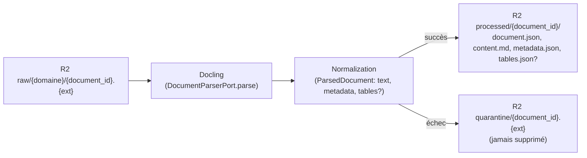

# Docling — parsing documentaire

## Abstraction (`adapters/docling.py`)

```
DocumentParserPort (Protocol)
  └─ parse(*, document_id, content: bytes, extension: str) -> ParsedDocument
```

- **`MockDoclingAdapter`** : implémentation déterministe sans dépendance,
  utilisée par tous les tests et le mode offline. Simule un texte normalisé
  plausible, détecte formats non supportés et contenus corrompus.
- **`DoclingWorkerAdapter`** : implémentation réelle. Importe `docling` en
  lazy (au premier appel) et échoue avec un message explicite s'il est
  absent — **Docling n'est installé que dans l'environnement worker prévu,
  jamais dans le venv de développement local** (cohérent avec CLAUDE.md
  Phase 0 et Phase 3).

## Flux



## Artefacts produits (par document traité avec succès)

- `processed/{document_id}/document.json` — enveloppe (id, extension,
  longueur de texte).
- `processed/{document_id}/content.md` — texte normalisé.
- `processed/{document_id}/metadata.json` — métadonnées extraites.
- `processed/{document_id}/tables.json` — **uniquement** si le document
  contient des tableaux (xlsx, csv dans la version actuelle du mock).

Aucun embedding n'est créé à ce stade (explicitement hors périmètre Phase 3).

## Intégrité avant parsing

`ingestion/pipeline.py::ingest` recalcule le SHA-256 du contenu téléchargé
et le compare au checksum stocké en métadonnée R2 (`head().checksum`) avant
tout parsing : une divergence déclenche une mise en quarantaine
`CHECKSUM_MISMATCH` (voir [docs/quarantine](../quarantine/README.md)).

## Worker Cloud Run distant (`worker/docling_worker.py`)

Architecture : `Cloudflare R2 EU -> Google Cloud Run Job -> Docling -> R2
processed/quarantine`. Le worker réutilise directement `ingestion.pipeline
::ingest` (aucune logique dupliquée) avec le vrai `DoclingWorkerAdapter` et
un vrai `R2StorageAdapter` — aucun document n'est jamais persisté sur le
disque du worker (traitement en mémoire).

- Entrée : `DOCUMENT_ID` (un seul document, prioritaire) ou `LIMIT` (les N
  premiers du manifest, chargé depuis `manifests/document_manifest.json`
  sur R2 — ce fichier doit y être déposé au préalable).
- Conteneur : `worker/Dockerfile` (Python 3.12 slim + torch CPU +
  `docling==2.130.0`, épinglé, vérifié sur PyPI). `worker/requirements.txt`.
- Déploiement (non appliqué) : `worker/cloudrun-job.yaml` — région
  `europe-west9`, 2 vCPU / 8 GiB / 1 tâche / parallélisme 1 / timeout 15 min,
  credentials exclusivement via secrets Cloud Run (jamais en dur).
- Tests offline : `tests/test_docling_worker.py` (orchestration, succès,
  quarantaine, absence de fichier temporaire local, aucun secret loggé).
