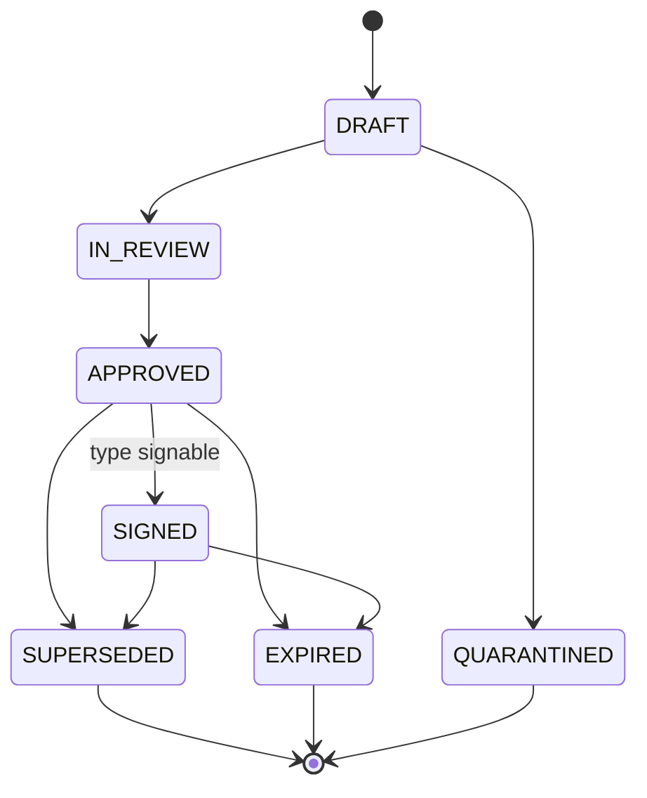

# Gouvernance documentaire Phase 2

## Statuts (`domain/models.py::DocumentStatus`)

`DRAFT → IN_REVIEW → APPROVED → SIGNED` (types signables) ou `→ APPROVED`
(types non signables) ; états terminaux `SUPERSEDED`, `EXPIRED`,
`QUARANTINED` à tout moment.

## Classifications (`domain/models.py::Classification`, réutilisée de Phase 0)

`PUBLIC` < `INTERNAL` < `CONFIDENTIAL` < `RESTRICTED` < `PERSONAL_DATA` <
`SENSITIVE_PERSONAL_DATA`. Mapping type → classification :
`generation/document_taxonomy_rules.py::TYPE_CLASSIFICATION`.

## ACL (allowed_groups)

Règle déterministe (`document_generator.py::_allowed_groups_for`) :
- `PUBLIC` / `INTERNAL` → `RAG_ALL_EMPLOYEES` ;
- sinon → groupe départemental de base (`DOMAIN_BASE_GROUP`), + `RAG_EXECUTIVE`
  si `RESTRICTED` ;
- + `RAG_CLIENT_{code}` si lié à un client (sauf `PUBLIC`) ;
- + `RAG_PROJECT_{code}` si lié à un projet.

Jamais de groupe large sur un document `RESTRICTED` ou
`SENSITIVE_PERSONAL_DATA` (testé, deny-by-default hérité de Phase 1).

## Rétention (`retention_policy`, par domaine)

RH et Legal/Contracts : `10_YEARS` · Finance/Compliance : `7_YEARS` ·
Clients/Prospects, Pricing/Sales, IT/Architecture/Security : `5_YEARS` ·
Projects/Procedures : `3_YEARS`.

## Anomalies (15 types, 3 instances chacun = 45, + 15 issues des conflits = 60)

Chaque anomalie a un `anomaly_id` (`ANOM-00001`..) et un `ground_truth`
(`data/seed/document_anomalies.json`) :

| Type | Description |
|---|---|
| OBSOLETE_VERSION | Version remplacée non repassée SUPERSEDED |
| EXPIRED_DOCUMENT | `valid_to` passée, statut encore actif |
| DUPLICATE | Deux `document_id` distincts, même title/type/client |
| MISSING_OWNER | `owner` vide |
| WRONG_CLASSIFICATION | Reclassé PUBLIC à tort |
| ACL_INCOHERENT | `allowed_groups` trop permissif pour la classification |
| INCOMPLETE_DOCUMENT | Champ obligatoire manquant (`valid_from`) |
| CONTRADICTORY_DOCUMENTS | Voir [conflits](../scenarios/README.md) |
| AMENDMENT_CONTRADICTS_CONTRACT | Voir [conflits](../scenarios/README.md) |
| OBSOLETE_PRICING | Grille tarifaire expirée mais APPROVED |
| CRM_STATUS_INCOHERENT | ExpectedContract SIGNED sans contrat signé au manifest |
| UNSIGNED_DOCUMENT | Contrat ancien jamais signé |
| PARTIAL_SIGNATURE | ExpectedContract PARTIALLY_SIGNED |
| OCR_RISK | Signalement qualité de scan (pour futurs tests Docling) |
| INCOHERENT_DATES | `signed_at` antérieur à `created_at` |

Génération : `generation/anomaly_generator.py` (déterministe, seed documenté
dans PHASE-2-REPORT.md).
