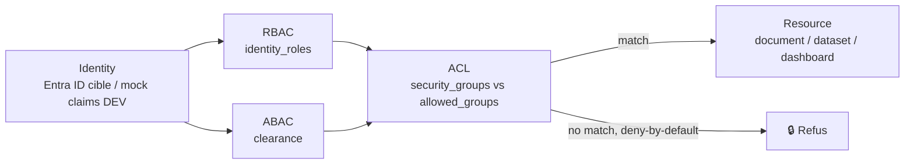

# Identity & Security — RBAC / ABAC / ACL

## Principe

Le moteur d'autorisation (`src/rag_enterprise_lab/security/authorization.py`)
est **déterministe, fondé sur des règles, et deny-by-default** à chaque étage.
Jev et Claude ne sont **jamais** consultés pour une décision ALLOW/DENY (voir
[ADR-002](../decisions/ADR-002-authorization-before-llm.md)) — vérifié par
`tests/test_identity.py::test_jev_and_claude_are_never_authorization_dependencies`
(inspection des imports du module).

Ordre d'évaluation (`security/authorization.decide`) : **ACL → RBAC → ABAC**,
la première étape qui refuse arrête l'évaluation (fail closed). Une ressource
sans `allowed_groups` est refusée à tous (`NO_ACL_DEFINED`).

## Groupes Identity

### Statiques (11)

`RAG_ALL_EMPLOYEES`, `RAG_HR`, `RAG_FINANCE`, `RAG_LEGAL`, `RAG_SALES`,
`RAG_IT`, `RAG_DATA_AI`, `RAG_ENGINEERING`, `RAG_EXECUTIVE`, `RAG_MARKETING`,
et `RAG_CONSULTING` (ajout Phase 1, voir PHASE-1-REPORT.md § remarques).

### Dynamiques (matérialisés pour chaque instance Phase 1)

- `RAG_CLIENT_{CLIENT_CODE}` — un par client actif (65), attribué à
  l'account manager et au sales manager du compte.
- `RAG_PROJECT_{PROJECT_CODE}` — un par projet de delivery (65), attribué au
  lead et aux membres de l'équipe projet.

Construits par `identity/groups.py::client_group()` / `project_group()`, la
liste complète matérialisée est dans `data/seed/identity_groups.json`.

## RBAC — rôles applicatifs (`identity/rbac.py::Role`)

`EMPLOYEE`, `MANAGER`, `TEAM_LEAD`, `DEPARTMENT_HEAD`, `EXECUTIVE`,
`SALES_DIRECTOR`, `SALES_MANAGER`, `ACCOUNT_MANAGER`, `SALES_OPERATIONS`,
`PROJECT_LEAD`, `PROJECT_MEMBER`, `HR_ADMIN`, `FINANCE_ADMIN`, `LEGAL_ADMIN`,
`IT_ADMIN`. Portés par `Employee.identity_roles`, dérivés du poste à la
génération.

## ABAC — attribut `clearance` (`domain/organization.py::Clearance`)

| Niveau | Rang | Attribué à |
|---|---|---|
| `STANDARD` | 0 | Contributeurs, par défaut |
| `ELEVATED` | 1 | Heads, Leads, et tout le département Finance / Legal + RH (données personnelles / financières sensibles) |
| `EXECUTIVE` | 2 | Direction (CEO + 5 C-level) |

Une `Resource.minimum_clearance` refuse tout utilisateur dont le rang est
strictement inférieur (`CLEARANCE_RANK`).

## Invariant deny-by-default

Testé dans `tests/test_identity.py` :
- aucun `allowed_groups` → refus (`NO_ACL_DEFINED`) ;
- aucune intersection de groupes → refus (`ACL_NO_MATCH`) ;
- clearance insuffisante → refus (`ABAC_CLEARANCE_INSUFFICIENT`) même si l'ACL
  et le RBAC sont satisfaits.

## Non négociable

Jev et Claude ne décident jamais ALLOW/DENY, ni une suppression RGPD
définitive, ni une règle légale irréversible (voir CLAUDE.md § Jev).
