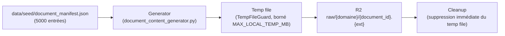

# Pipeline d'ingestion — manifest → génération → upload

## Flux

Pour chaque entrée du manifest : génération déterministe → écriture temp
file borné → vérification d'idempotence (`store.head`) → upload → suppression
immédiate du fichier temporaire (`try/finally`, y compris en cas d'erreur).

## Génération de contenu (`generation/document_content_generator.py`)

7 formats supportés, choisis par cohérence métier
(`generation/document_format_rules.py`), pas par distribution uniforme :

| Format | Types de documents (exemples) |
|---|---|
| PDF / DOCX (alterné) | contrats, avenants, NDA, DPA, bons de commande |
| XLSX | grilles tarifaires, budgets, plans de delivery |
| PPTX | rapports de statut projet |
| Markdown | runbooks, procédures, politiques |
| HTML | rapports d'incident, post-mortems, conformité |
| CSV | contacts, paie, factures |

Aucune dépendance supplémentaire : PDF est écrit en syntaxe PDF minimale à
la main ; DOCX/XLSX/PPTX sont des archives ZIP OOXML minimales valides
(`zipfile` + XML stdlib).

## Idempotence

`document_id` + checksum SHA-256 du contenu généré :
- objet identique déjà présent (`head().checksum` égal) → **SKIP** ;
- `document_id` identique mais checksum différent → **CONFLICT**, l'objet
  existant n'est **jamais écrasé silencieusement** ;
- absent → upload normal.

## `MAX_LOCAL_TEMP_MB`

`ingestion/temp_guard.py::TempFileGuard` refuse toute écriture qui
dépasserait la limite : `TempDiskLimitExceeded` est levée, le répertoire
temporaire est nettoyé, et le run entier s'arrête (STOP / CLEANUP / ERROR).

## `--dry-run` et `--limit N`

`scripts/phase3_ingest.py generate_and_upload --dry-run --limit N` simule
la génération sans jamais appeler `store.put_bytes` — zéro objet R2 créé,
vérifié par test (`test_dry_run_creates_zero_remote_objects`). `--limit N`
permet la validation progressive (1 → 10 → 50 → 500 → 5000).

## Observabilité

Chaque run affiche : `processed`, `uploaded`, `skipped`, `conflicts`,
`quarantined`, `failed`, `bytes_uploaded`, `temp_disk_current_mb`,
`temp_disk_peak_mb`, `duration_seconds`. Aucun secret n'apparaît jamais
dans les événements d'audit ni les logs (testé).
