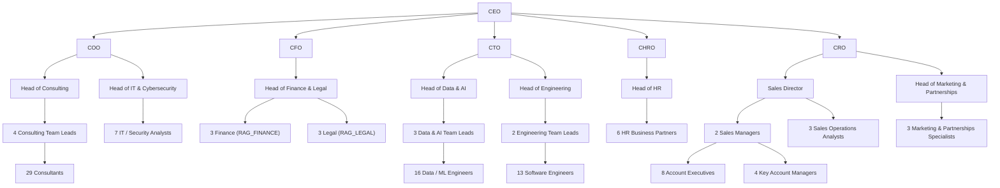

# Organisation — GenAI Enterprise Lab SAS

Modèle synthétique, déterministe (seed=42), généré par
`scripts/generate_phase1_dataset.py` → `data/seed/employees.json`.

## Effectifs par département (120 exactement)

| Département | Business Unit | Effectif |
|---|---|---|
| Direction | Corporate | 6 |
| Sales / Account | Go-To-Market | 18 |
| Consulting | Delivery | 34 |
| Data & AI | Delivery | 20 |
| Engineering | Delivery | 16 |
| IT / Cybersecurity | Delivery | 8 |
| RH | Corporate | 7 |
| Finance / Legal | Corporate | 7 |
| Marketing / Partnerships | Go-To-Market | 4 |
| **Total** | | **120** |

## Structure Sales / Account (18)

| Rôle | Effectif | Reporte à |
|---|---|---|
| Sales Director | 1 | CRO (Direction) |
| Sales Manager | 2 | Sales Director |
| Account Executive | 8 | 1 des 2 Sales Managers (4/4) |
| Key Account Manager | 4 | 1 des 2 Sales Managers (2/2) |
| Sales Operations Analyst | 3 | Sales Director |

## Structure Finance / Legal (7)

Le département est unique mais deux groupes Identity distincts existent
(`RAG_FINANCE`, `RAG_LEGAL`). Le Head porte les deux rôles ; les 6
contributeurs sont répartis 3 pistes Finance / 3 pistes Legal :

| Titre | Piste | Groupe |
|---|---|---|
| Financial Controller | FINANCE | RAG_FINANCE |
| Accountant | FINANCE | RAG_FINANCE |
| FP&A Analyst | FINANCE | RAG_FINANCE |
| Legal Counsel | LEGAL | RAG_LEGAL |
| Contracts Manager | LEGAL | RAG_LEGAL |
| Compliance Officer | LEGAL | RAG_LEGAL |

## Schéma d'organisation (condensé)

Le schéma ci-dessous représente les niveaux de la hiérarchie (Direction,
têtes de département, leads) avec les effectifs agrégés par groupe de
contributeurs. Le détail nominatif des 120 collaborateurs est dans
`data/seed/employees.json` (chaque enregistrement porte `manager_id`).

## Référentiels commerciaux

| Référentiel | Volume | Fichier |
|---|---|---|
| Clients actifs | 65 | `data/seed/clients.json` |
| Prospects | 120 | `data/seed/prospects.json` |
| Partenaires | 30 | `data/seed/partners.json` |
| Fournisseurs / prestataires | 80 | `data/seed/suppliers.json` |
| Projets (1 par client actif) | 65 | `data/seed/projects.json` |
| Opportunités / contrats attendus | 65 | `data/seed/opportunities.json` |

Toutes les personnes et organisations sont fictives (voir
`src/rag_enterprise_lab/generation/namebank.py` : banques de noms/entreprises
construites par combinaison, aucune donnée réelle).
