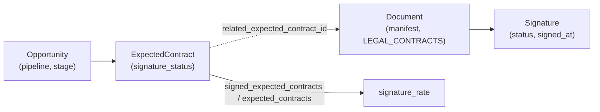

# Scénarios métier — clôture commerciale & conflits documentaires

## Clôture commerciale mensuelle

`Opportunity` (pipeline) et `ExpectedContract` (suivi de signature) sont deux
entités distinctes depuis le correctif Phase 1/2 — voir
[docs/data-model/README.md](../data-model/README.md#opportunity--expectedcontract-domainsalespy).
`signature_rate` est calculé en Python pur
(`generation/expected_answers_generator.py`), **jamais via Jev**.

`ExpectedContract.signature_status` couvre les 7 cas demandés : aucun
document (`NOT_SENT`), draft (`NOT_SENT`/`SENT` selon l'avancement),
`SENT`, `VIEWED`, `PARTIALLY_SIGNED`, `SIGNED`, `DECLINED`, `BLOCKED`.

## Conflits documentaires (7 catégories, 3 exemples chacune = 21)

Ground truth toujours dérivé de l'autorité (`AUTHORITY_RANK`) ou de la
source de vérité calculable (**BUSINESS_REGISTRY**, actuellement implémentée
par les fichiers seed structurés `data/seed/*.json` — PostgreSQL en sera
l'implémentation persistante dans une phase ultérieure) — jamais d'une
simple règle de fraîcheur. Exemple canonique
(`data/seed/document_conflicts.json`) :

| Contrat client | Avenant signé | Ground truth |
|---|---|---|
| `payment_terms = 30 jours` | `payment_terms = 45 jours` | **45 jours** (SIGNED_AMENDMENT > SIGNED_CONTRACT) |

| Catégorie | Champ | Règle de résolution |
|---|---|---|
| PAYMENT_TERMS | payment_terms_days | Avenant signé > contrat signé |
| PRICING | unit_price_eur | Version de grille tarifaire non supersedée > version SUPERSEDED |
| CONTRACT_DATES | contract_end_date_offset_days | Avenant signé > contrat signé |
| SLA | sla_response_hours | Avenant signé > contrat signé |
| NOTICE_PERIOD | notice_period_days | Avenant signé > contrat signé |
| RENEWAL | auto_renewal | Avenant signé > contrat signé |
| CUSTOMER_STATUS | customer_status | BUSINESS_REGISTRY (registre client Phase 1) fait autorité, pas un document |

## Ground truth exploitable (`data/seed/document_expected_answers.json`)

27 entrées `QA-00001`..`QA-00027` : 21 dérivées des conflits, 5 de la
complétude documentaire (dossiers client), 1 sur le `signature_rate` global
du mois — support direct des futurs tests automatiques du RAG.
