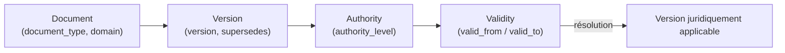

# Résolution de version et d'autorité

Trois notions **séparées, jamais confondues** :

1. **Version chronologique** (`version` : `"1.0"`, `"2.0"`, ...) — l'ordre
   dans lequel les documents ont été créés.
2. **Validité métier** (`valid_from` / `valid_to`) — la fenêtre pendant
   laquelle un document s'applique.
3. **Autorité légale** (`authority_level`) — quel document fait foi en cas de
   désaccord, indépendamment des deux notions précédentes.

> Une version plus récente n'est **pas** automatiquement la version
> applicable.

## Niveaux d'autorité (configurables — `domain/documents.py::AUTHORITY_RANK`)

```
SIGNED_AMENDMENT > SIGNED_CONTRACT > SIGNED_PURCHASE_ORDER >
APPROVED_PROPOSAL > APPROVED_PRICING_GRID > DRAFT
```

Dérivation déterministe (type, statut) → autorité :
`domain/version_authority.py::authority_level_for`. Exemple : un
`CONTRACT_AMENDMENT` `SIGNED` obtient `SIGNED_AMENDMENT` (rang 0) même s'il
est plus ancien qu'un `CLIENT_CONTRACT` `SIGNED` plus récent (rang 1) — testé
dans `tests/test_document_authority.py::test_signed_amendment_beats_signed_contract_regardless_of_recency`.

Un document `SUPERSEDED` retombe à `DRAFT` (rang 5) : une fois remplacé, il
ne peut plus faire autorité, quel qu'ait été son statut antérieur.

## Résolution (`resolve_authoritative_version`)

Sur une chaîne de versions (liées par `supersedes`), priorité :
1. rang d'autorité le plus fort (le plus bas) ;
2. à égalité, `valid_from` le plus récent ;
3. à égalité, `created_at` le plus récent.

Chaque critère est un champ du manifest — aucune heuristique cachée,
entièrement explicable.

## Cycle de vie documentaire



## Chaînes de version dans le dataset généré

`generation/version_chain_builder.py` construit deux types de liens
`supersedes`, garantis acycliques par construction (voir docstring du
module) :
- chaînes chronologiques pour les types versionables
  (`CLIENT_CONTRACT`, `SUPPLIER_CONTRACT`, `PARTNER_CONTRACT`,
  `EMPLOYMENT_CONTRACT`, `PRICING_GRID`) : même type + même entité liée,
  triés par `created_at` ;
- avenants (`CONTRACT_AMENDMENT`, `EMPLOYMENT_AMENDMENT`) → tête courante du
  contrat de base correspondant.

Voir PHASE-2-REPORT.md pour 5 exemples concrets extraits du dataset généré.
